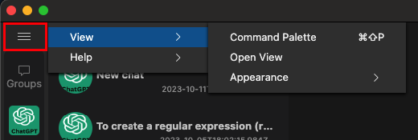
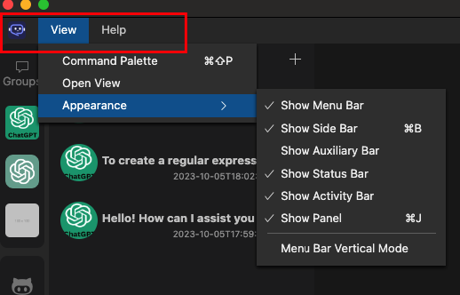

# MenuBar

The MenuBar extension allows you to add menu items to the top menu bar of the app.

Default menu bar:



Horizontal menu bar:




## Adding a menu item

To add a new menu item, we need to create a new object with the following properties, and then call the `add` method from the `menuBar` service:

```typescript
const addTodoItemMenuItem: IMenuBarItem = {
    id: 'myExtension.menuBar.addItem',
    name: 'Add Item',
    icon: 'project',
};

context.services.menuBar.append(addTodoItemMenuItem, 'MyExtension');

```

The `id` property is used to identify the menu item. It must be unique. If you try to add a menu item with an id that already exists, the previous menu item will be added instead of the new one.

The second parameter is the `parentId` property. It is used to group menu items. If you want to add a menu item to the root of the menu bar, you can pass undefined to the `parentId` parameter.

## Detecting menu item click

You can use the `onSelect` event to detect when a menu item is clicked:

```typescript
context.services.menuBar.onSelect((id) => {
    if (id === 'myExtension.menuBar.addItem') {
        console.log('Add item clicked!');
    }
});
```